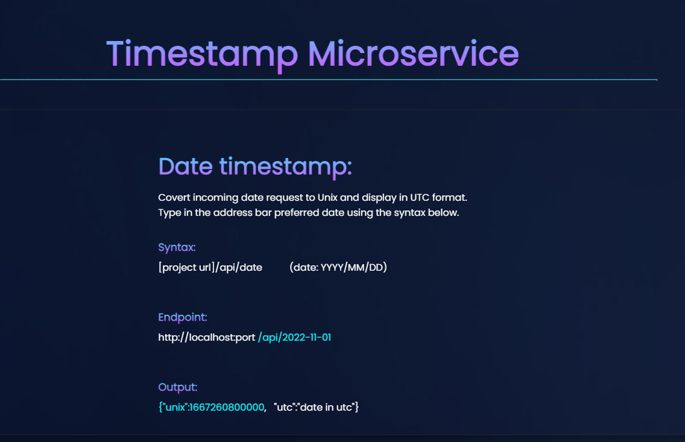

## Timestamp Microservice - A Backend Project

In software development Micro-services are simply an organisational approach where an applications is made up of small independent services that communicate over well-defined APIs.
 
 They are also known as Microservice Architecture. The biggest advantage is that they are loosely coupled so if something is broken we can easily pinpoint faults and fix things, but also if we make small changes it won't end up breaking the entire app.

 Timestamp Microservice handles date & unix API requests and converts date to unix time in UTC format and vice versa.


<br>


### Boilerplate
```
Boilerplate code used from FreeCodeCamp at: 
https://github.com/freeCodeCamp/boilerplate-project-timestamp/

```


<br>

### Dependencies
```
cors
dotenv
express
nodemon

```

<br>

### Getting Started
```
npm i cors express nodemon dotenv 
npm start 

```

<br>

### Inside package.json...
```
  "scripts": {
    "start": "nodemon index.js"
```

<br>

### Demo
https://timestamp.zeenux0.repl.co/




